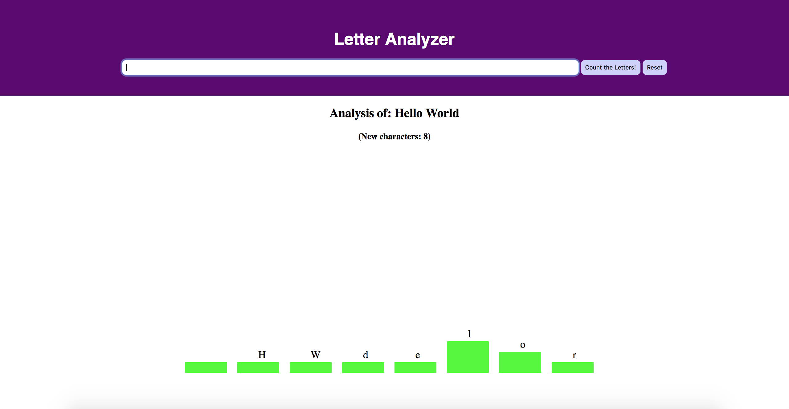
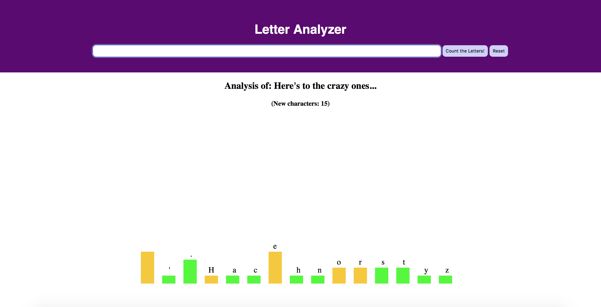

# Letter Count App

This is a simple App based on JavaScript and D3.js that counts the number of letters in a phrase and displays a graphic with their absolute frequency

Introduce a phrase for the first time.

When you enter another phrase, the bars will change color to indicate which letters are new and which ones were present in the previous phrase.

Have fun!